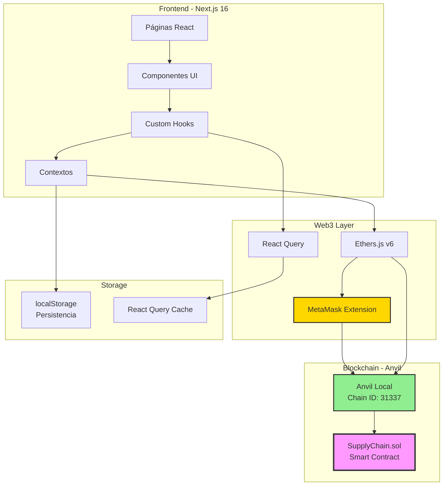
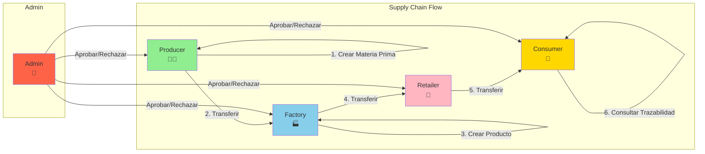
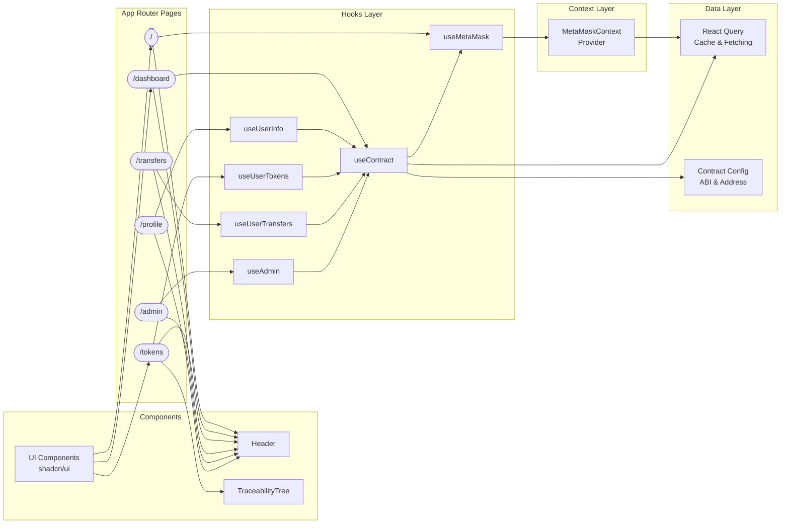
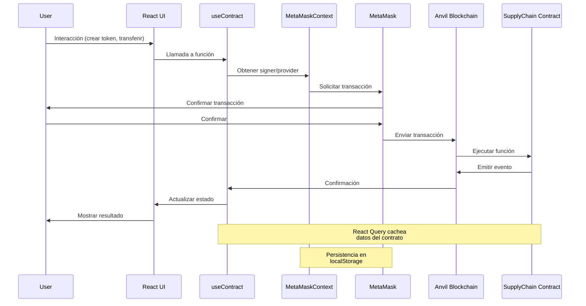
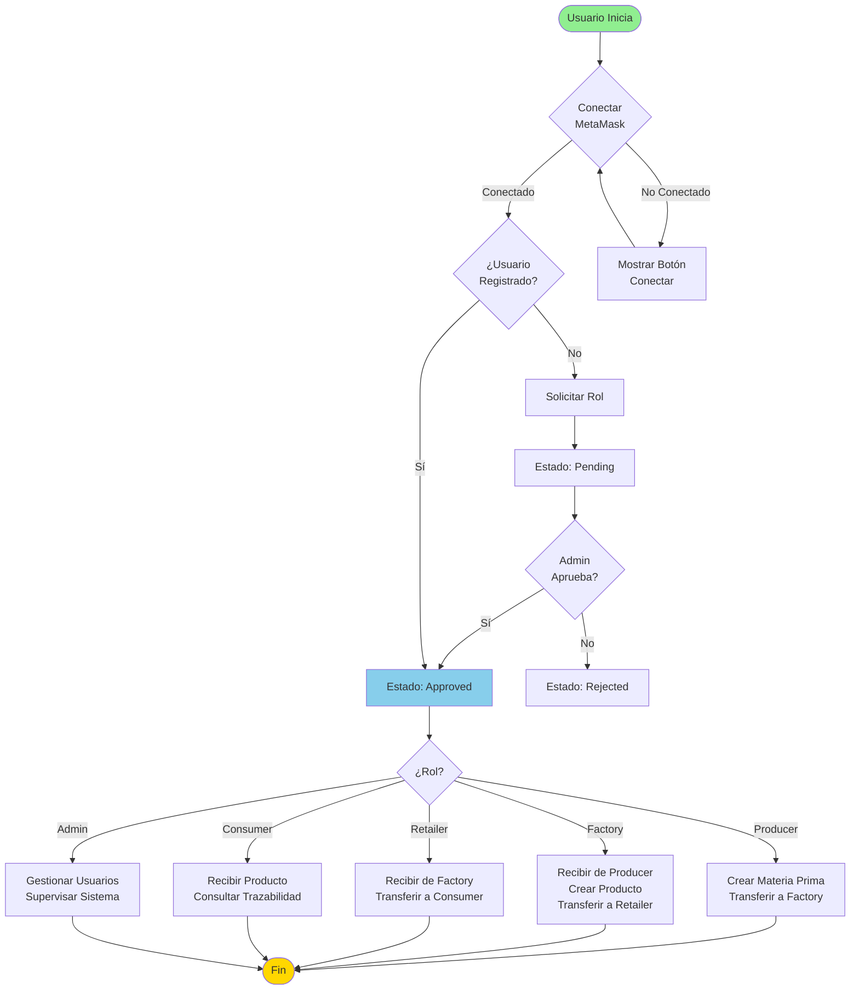

# 🔗 Supply Chain Tracker - DApp de Trazabilidad Blockchain

**Supply Chain Tracker** es una aplicación descentralizada (DApp) construida sobre blockchain Ethereum que permite rastrear productos y materias primas a lo largo de toda la cadena de suministro, desde el productor hasta el consumidor final. La aplicación garantiza transparencia, seguridad e inmutabilidad mediante contratos inteligentes.

---

## 📋 Tabla de Contenidos

- [Características](#-características)
- [Arquitectura](#-arquitectura)
- [Prerequisitos](#-prerequisitos)
- [Instalación](#-instalación)
- [Configuración](#-configuración)
- [Deploy del Contrato](#-deploy-del-contrato)
- [Ejecución](#-ejecución)
- [Estructura del Proyecto](#-estructura-del-proyecto)
- [Testing](#-testing)
- [Troubleshooting](#-troubleshooting)
- [Documentación Adicional](#-documentación-adicional)

---

## ✨ Características

- ✅ **Sistema de Gestión de Usuarios** con roles y aprobación administrativa
- ✅ **Tokenización** de materias primas y productos terminados
- ✅ **Sistema de Transferencias** controladas entre roles
- ✅ **Trazabilidad Completa** de productos desde origen hasta destino
- ✅ **Interfaz Web Moderna** y responsive con Next.js 16
- ✅ **Integración con MetaMask** para gestión de wallets
- ✅ **Panel de Administración** para gestión de usuarios
- ✅ **Tests Exhaustivos** para smart contracts y frontend

---

## 🏗️ Arquitectura

### Stack Tecnológico

**Smart Contracts:**
- Solidity 0.8.20
- Foundry (Forge, Anvil, Cast)
- Tests con Foundry Test

**Frontend:**
- Next.js 16 (App Router)
- TypeScript
- Tailwind CSS
- Ethers.js v6
- Shadcn UI
- React Query (@tanstack/react-query)

**Blockchain:**
- Anvil (blockchain local para desarrollo)
- Chain ID: 31337
- RPC URL: http://localhost:8545

### Diagramas de Arquitectura

#### Arquitectura General del Sistema



#### Flujo de Roles en la Cadena de Suministro



#### Arquitectura Detallada del Frontend



#### Flujo de Datos y Comunicación



#### Flujo Completo de Usuario



**Restricciones del Flujo de Roles:**
- Producer solo puede transferir a Factory
- Factory solo puede transferir a Retailer
- Retailer solo puede transferir a Consumer
- Consumer no puede transferir (punto final)
- Admin gestiona aprobaciones y supervisa el sistema

---

## 📋 Prerequisitos

Antes de comenzar, asegúrate de tener instalado:

1. **Node.js** (versión 18 o superior)
   ```bash
   node --version  # Debe ser >= 18
   npm --version
   ```

2. **Foundry** (para smart contracts)
   ```bash
   # Instalar Foundry
   curl -L https://foundry.paradigm.xyz | bash
   foundryup

   # Verificar instalación
   forge --version
   anvil --version
   cast --version
   ```

3. **Git**
   ```bash
   git --version
   ```

4. **MetaMask Browser Extension**
   - Instalar desde [metamask.io](https://metamask.io/)
   - Crear una wallet de prueba

---

## 🚀 Instalación

### 1. Clonar el Repositorio

```bash
git clone <repository-url>
cd final-project
```

### 2. Instalar Dependencias del Smart Contract

```bash
cd sc

# Instalar dependencias de Foundry
forge install

# Compilar contratos
forge build

# Verificar que compiló correctamente
ls out/SupplyChain.sol/SupplyChain.json
```

### 3. Instalar Dependencias del Frontend

```bash
cd ../dapp

# Instalar dependencias de Node.js
npm install

# Verificar instalación
npm list --depth=0
```

---

## ⚙️ Configuración

### 1. Configurar Blockchain Local (Anvil)

**Terminal 1 - Iniciar Anvil:**
```bash
# Iniciar Anvil con configuración específica
anvil --chain-id 31337 --mnemonic "test test test test test test test test test test test junk"

# Anvil mostrará información importante:
# - Direcciones de cuentas de prueba
# - Private keys de cada cuenta
# - RPC URL: http://127.0.0.1:8545
```

**Cuentas de Prueba por Defecto (Anvil):**
```
Account #0: 0xf39Fd6e51aad88F6F4ce6aB8827279cffFb92266 (Admin)
Account #1: 0x70997970C51812dc3A010C7d01b50e0d17dc79C8 (Producer)
Account #2: 0x3C44CdDdB6a900fa2b585dd299e03d12FA4293BC (Factory)
Account #3: 0x90F79bf6EB2c4f870365E785982E1f101E93b906 (Retailer)
Account #4: 0x15d34AAf54267DB7D7c367839AAf71A00a2C6A65 (Consumer)
```

### 2. Configurar MetaMask

1. **Agregar Red Local:**
   - Abrir MetaMask → Settings → Networks → Add Network
   - Network Name: `Anvil Local`
   - RPC URL: `http://127.0.0.1:8545`
   - Chain ID: `31337`
   - Currency Symbol: `ETH`
   - Block Explorer URL: (dejar vacío)

2. **Importar Cuentas de Prueba:**
   - MetaMask → Account → Import Account
   - Importar las private keys de Anvil para testing
   - Recomendado: Importar al menos Account #0 (Admin) y Account #1 (Producer)

### 3. Configurar Variables de Entorno del Frontend

```bash
cd dapp

# Copiar archivo de ejemplo
cp .env.example .env.local

# Editar .env.local con tus valores (ver siguiente sección)
```

**Archivo `.env.local` (actualizar después del deploy):**
```env
# Dirección del contrato desplegado (actualizar después del deploy)
NEXT_PUBLIC_CONTRACT_ADDRESS=0x5FbDB2315678afecb367f032d93F642f64180aa3

# URL del RPC (Anvil por defecto)
NEXT_PUBLIC_RPC_URL=http://127.0.0.1:8545

# Chain ID (Anvil por defecto es 31337)
NEXT_PUBLIC_CHAIN_ID=31337

# Dirección del admin del contrato
NEXT_PUBLIC_ADMIN_ADDRESS=0xf39Fd6e51aad88F6F4ce6aB8827279cffFb92266
```

---

## 📦 Deploy del Contrato

### Opción 1: Deploy con Script de Foundry (Recomendado)

**Terminal 2 - Desplegar Contrato:**
```bash
cd sc

# Desplegar usando el script (usa la primera cuenta de Anvil por defecto)
forge script script/Deploy.s.sol \
  --rpc-url http://127.0.0.1:8545 \
  --broadcast

# O especificar private key explícitamente
forge script script/Deploy.s.sol \
  --rpc-url http://127.0.0.1:8545 \
  --private-key 0xac0974bec39a17e36ba4a6b4d238ff944bacb478cbed5efcae784d7bf4f2ff80 \
  --broadcast
```

**El script mostrará:**
```
==========================================
SupplyChain deployed successfully!
Contract address: 0x5FbDB2315678afecb367f032d93F642f64180aa3
Admin address: 0xf39Fd6e51aad88F6F4ce6aB8827279cffFb92266
==========================================
```

### Opción 2: Deploy Manual con Forge

```bash
cd sc

# Desplegar directamente
forge create src/SupplyChain.sol:SupplyChain \
  --rpc-url http://127.0.0.1:8545 \
  --private-key 0xac0974bec39a17e36ba4a6b4d238ff944bacb478cbed5efcae784d7bf4f2ff80
```

### 3. Actualizar Configuración del Frontend

Después del deploy, actualizar:

**`dapp/contracts/config.ts`:**
```typescript
export const CONTRACT_ADDRESS = "0x..."; // Dirección del contrato desplegado
```

**`dapp/.env.local`:**
```env
NEXT_PUBLIC_CONTRACT_ADDRESS=0x... # Misma dirección del contrato
```

**Copiar ABI del Contrato:**
```bash
# Copiar ABI desde la compilación de Foundry
cp sc/out/SupplyChain.sol/SupplyChain.json dapp/contracts/SupplyChain.json
```

---

## ▶️ Ejecución

### 1. Iniciar Anvil (Terminal 1)

```bash
anvil --chain-id 31337 --mnemonic "test test test test test test test test test test test junk"
```

**Mantener esta terminal abierta** - Anvil debe estar corriendo mientras uses la aplicación.

### 2. Iniciar Frontend (Terminal 2)

```bash
cd dapp
npm run dev
```

La aplicación estará disponible en: **http://localhost:3000**

### 3. Usar la Aplicación

1. **Abrir navegador** en http://localhost:3000
2. **Conectar MetaMask** usando el botón "Conectar Wallet"
3. **Seleccionar cuenta** importada (recomendado: Account #0 para admin)
4. **Aceptar conexión** en MetaMask
5. **Navegar** por la aplicación según tu rol

---

## 📁 Estructura del Proyecto

```
final-project/
├── sc/                          # Smart Contracts
│   ├── src/
│   │   └── SupplyChain.sol      # Contrato principal
│   ├── script/
│   │   └── Deploy.s.sol         # Script de deploy
│   ├── test/
│   │   └── SupplyChain.t.sol    # Tests del contrato
│   ├── foundry.toml             # Configuración Foundry
│   └── out/                     # Artefactos compilados
│       └── SupplyChain.sol/
│           └── SupplyChain.json # ABI del contrato
│
├── dapp/                        # Frontend Next.js
│   ├── app/                     # Páginas (App Router)
│   │   ├── page.tsx            # Página principal
│   │   ├── dashboard/          # Dashboard
│   │   ├── tokens/             # Gestión de tokens
│   │   ├── transfers/          # Transferencias
│   │   ├── admin/              # Panel de administración
│   │   └── profile/            # Perfil de usuario
│   ├── components/             # Componentes React
│   │   ├── ui/                 # Componentes base (shadcn)
│   │   ├── Header.tsx          # Navegación principal
│   │   └── TraceabilityTree.tsx # Visualización de trazabilidad
│   ├── contexts/              # Contextos React
│   │   └── MetaMaskContext.tsx # Contexto de MetaMask
│   ├── hooks/                 # Custom hooks
│   │   ├── useMetaMask.ts     # Hook de MetaMask
│   │   ├── useContract.ts     # Hook del contrato
│   │   ├── useUserInfo.ts     # Hook de información de usuario
│   │   └── ...
│   ├── contracts/             # Configuración del contrato
│   │   ├── config.ts          # Configuración
│   │   └── SupplyChain.json   # ABI del contrato
│   ├── types/                # Tipos TypeScript
│   └── package.json          # Dependencias
│
├── implementation_plan.md     # Plan de implementación completo
├── PRD.md                     # Product Requirements Document
└── README.md                  # Este archivo
```

---

## 🧪 Testing

### Tests del Smart Contract

```bash
cd sc

# Ejecutar todos los tests
forge test

# Test con verbosidad alta (para debugging)
forge test -vvv

# Test específico
forge test --match-test testCreateToken -vvv

# Ver cobertura de tests
forge coverage

# Test con gas report
forge test --gas-report
```

### Tests del Frontend

```bash
cd dapp

# Ejecutar tests unitarios
npm test

# Ejecutar todos los tests (incluyendo integración)
npm run test:all

# Ejecutar solo tests de integración
npm run test:unit

# Ejecutar solo tests de integración
npm run test:integration

# Ejecutar tests en modo watch
npm test -- --watch
```

### Validación de Build

```bash
cd dapp

# Build de producción (detecta errores de tipos)
npm run build

# Linting
npm run lint

# Verificar tipos TypeScript
npx tsc --noEmit
```

---

## 🔧 Troubleshooting

### Problema: "MetaMask not detected"

**Solución:**
- Verificar que MetaMask esté instalado en el navegador
- Verificar que estés usando un navegador compatible (Chrome, Firefox, Edge)
- Recargar la página después de instalar MetaMask

### Problema: "Wrong network" o "Unsupported chain"

**Solución:**
- Verificar que MetaMask esté conectado a la red "Anvil Local" (Chain ID: 31337)
- Si no existe la red, agregarla manualmente (ver sección Configuración)
- Verificar que Anvil esté corriendo en el puerto 8545

### Problema: "Contract not deployed" o "Contract address not found"

**Solución:**
1. Verificar que Anvil esté corriendo
2. Verificar que el contrato esté desplegado:
   ```bash
   cd sc
   forge script script/Deploy.s.sol --rpc-url http://127.0.0.1:8545 --broadcast
   ```
3. Actualizar `dapp/contracts/config.ts` y `dapp/.env.local` con la dirección del contrato
4. Copiar el ABI actualizado:
   ```bash
   cp sc/out/SupplyChain.sol/SupplyChain.json dapp/contracts/SupplyChain.json
   ```

### Problema: "Transaction reverted" o "User not approved"

**Solución:**
- Verificar que el usuario esté registrado y aprobado
- Si eres admin, aprobar el usuario desde `/admin/users`
- Verificar que el usuario tenga el rol correcto para la operación

### Problema: "Anvil connection refused"

**Solución:**
- Verificar que Anvil esté corriendo: `anvil --chain-id 31337`
- Verificar que el puerto 8545 no esté ocupado por otro proceso
- Verificar la URL en `.env.local`: `NEXT_PUBLIC_RPC_URL=http://127.0.0.1:8545`

### Problema: Build de Next.js falla con "generate is not a function"

**Solución:**
- Este es un problema conocido con Next.js 16 y Tailwind CSS
- El servidor de desarrollo funciona correctamente (`npm run dev`)
- Para producción, usar `npm run build` (debe funcionar con la configuración actual)
- Si persiste, verificar versiones en `package.json`:
  - `next`: `16.0.7` o superior
  - `tailwindcss`: `3.4.18`
  - `postcss`: `^8.4.31`

### Problema: Tests de frontend fallan con "React.act is not a function"

**Solución:**
- Este problema ya está resuelto con el polyfill en `jest.polyfill.js`
- Verificar que `jest.config.js` incluya `jest.polyfill.js` en `setupFiles`
- Ejecutar: `npm test` (debe funcionar correctamente)

### Problema: Error de hidratación en React

**Solución:**
- Verificar que no haya elementos `<div>` dentro de `<p>`
- El componente `AddressDisplay` debe usarse dentro de `<div>`, no `<p>`
- Este problema ya está corregido en el código

---

## 📚 Documentación Adicional

### Documentos del Proyecto

- **[implementation_plan.md](./implementation_plan.md)**: Plan completo de implementación con todas las fases y tareas
- **[PRD.md](./PRD.md)**: Product Requirements Document con especificaciones detalladas

### Rutas de la Aplicación

- **`/`** - Página principal (conexión/registro)
- **`/dashboard`** - Dashboard personalizado por rol
- **`/tokens`** - Lista de tokens del usuario
- **`/tokens/create`** - Crear nuevo token
- **`/tokens/[id]`** - Detalles del token y trazabilidad
- **`/tokens/[id]/transfer`** - Transferir token
- **`/transfers`** - Gestión de transferencias
- **`/admin`** - Panel de administración (solo Admin)
- **`/admin/users`** - Gestión de usuarios (solo Admin)
- **`/profile`** - Perfil del usuario

### Comandos Útiles

**Smart Contracts:**
```bash
# Compilar
forge build

# Tests
forge test

# Deploy
forge script script/Deploy.s.sol --rpc-url http://127.0.0.1:8545 --broadcast

# Verificar contrato desplegado
cast call <CONTRACT_ADDRESS> "admin()" --rpc-url http://127.0.0.1:8545
```

**Frontend:**
```bash
# Desarrollo
npm run dev

# Build
npm run build

# Tests
npm test

# Linting
npm run lint
```

---

## 🎯 Flujo de Trabajo Recomendado

### 1. Desarrollo Local

1. **Iniciar Anvil** en una terminal
2. **Desplegar contrato** (solo una vez, o cuando cambies el contrato)
3. **Iniciar frontend** en otra terminal
4. **Conectar MetaMask** y usar la aplicación

### 2. Testing

1. **Ejecutar tests del contrato** antes de hacer cambios
2. **Ejecutar tests del frontend** para verificar componentes
3. **Probar manualmente** los flujos principales

### 3. Deploy

1. **Compilar contrato**: `forge build`
2. **Ejecutar tests**: `forge test`
3. **Desplegar**: `forge script script/Deploy.s.sol --rpc-url ... --broadcast`
4. **Actualizar configuración** del frontend
5. **Build del frontend**: `npm run build`

---

## 🤝 Contribución

Este proyecto sigue las mejores prácticas de desarrollo:

- **Tests exhaustivos** antes de hacer merge
- **Code review** para cambios importantes
- **Documentación** actualizada con cada cambio

---

## 📄 Licencia

Este proyecto es educativo y está destinado para fines de aprendizaje.

---

## 🎉 Estado del Proyecto

**✅ Fases Completadas:**
- ✅ Fase 0-8: Implementación completa
- ✅ Fase 9: Revisión y Ajuste
- ✅ Fase 10: Testing y Validación Final
- ✅ Fase 11: Documentación Final

**Estado Actual:**
- Smart Contracts: ✅ 100% implementado y testeado
- Frontend: ✅ 95% implementado (falta validación responsive automatizada)
- Tests: ✅ 90% cobertura (unitarios e integración)
- Documentación: ✅ 100% implementado

---

## 📞 Soporte

Para problemas o preguntas:
1. Revisar esta documentación
2. Consultar `implementation_plan.md` para detalles técnicos
3. Revisar `PRD.md` para especificaciones de producto
4. Verificar la sección de Troubleshooting

---

**¡Feliz desarrollo! 🚀💻🔗**
